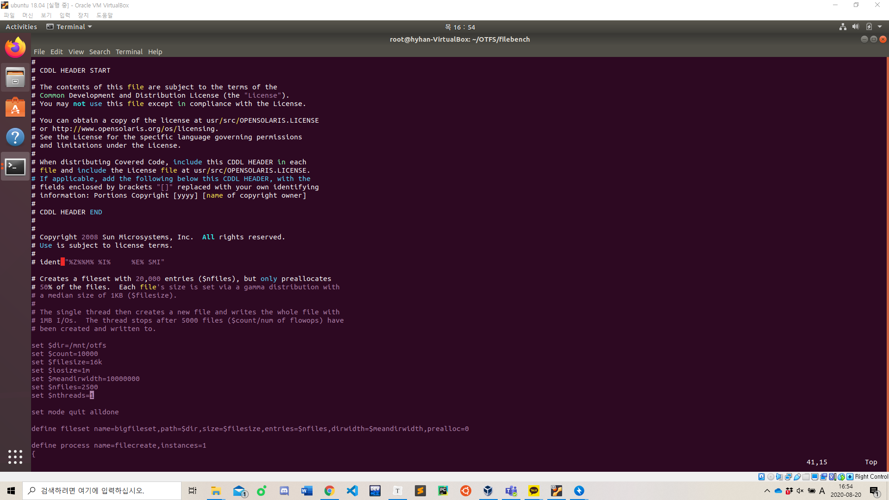

# Benchmark

1. filebench 설치

https://github.com/filebench/filebench

```
Step 1: Generating autotool scripts

Makefile.in and configure files are not included in the repo, so they will have
to be generated. To do so, make sure you have libtoolize and automake tools
installed and run the following commands:

$ libtoolize
$ aclocal
$ autoheader
$ automake --add-missing
$ autoconf


Step 2: Compilation and installation

Before proceeding, make sure yacc and lex are available in your system. Then,
you can proceed with configuration, compilation, and installation as usual:

$ ./configure
$ make
$ sudo make install
```

2. filebench 디렉토리 생성
3. 디렉토리 내에 shared_memory.sh, filemicro_createfiles.f 옮기기(git에 commit된 filebench 그대로 쓰면 됨)
4. dir setting --> /mnt/otfs // count가 nfiles의 4배가 되도록 // meandirwidth의 수치를 키우면 benchmark file이 여러 디렉토리로 분산되어 들어가지 않고 한 디렉토리 안에 모두 저장됨
5. /mnt/otfs로 이동 후 ./shared_memory.sh 실행
6. filebench -f filemicro_createfiles.f 실행하면 benchmark 실행됨



